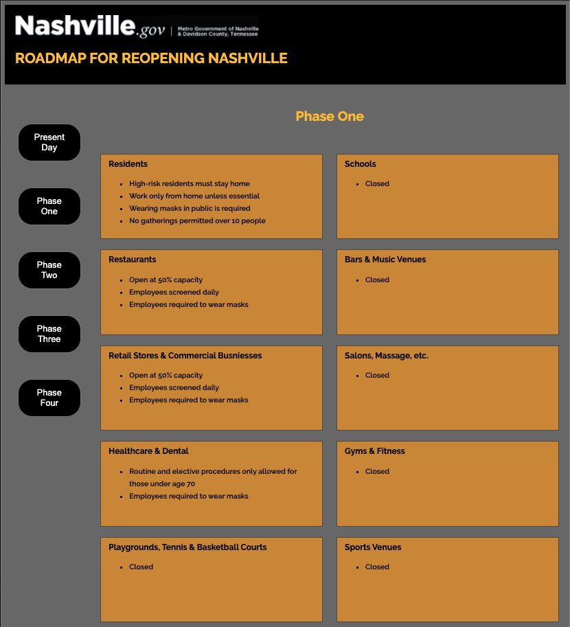

# Mayor Challenge
In April of 2020 while most of Nashville was on lockdown due to the COVID-19 pandemic, the mayor's office released its official multi-phase plan for reopening businesses. Unfortunately, the posted PDF lacked a lot of clarity and organization, so it was difficult to tell what the details of each phase in the plan actually were.

This web app was an attempt to simplify the presentation of the city's official plan by using a card type presentation with buttons for each phase of the plan. When the user clicks a button, the details of the restrictions in each category change accordingly.

It was built as a bonus assignment during my enrollment at [Nashville Software School](http://nashvillesoftwareschool.com/) while we were learning to make web pages that would be dynamically created from data arrays in Javascript.

## Features
* Buttons change color as user hovers on them
* The cards are generated from data in an array so that nothing is hard coded and the information culd be easily changed if required without modifying the HTML file.

## Screenshot

## Installation
* Clone this repo to your local machine using `https://github.com/petestewart72/mayorchallenge`
* Run in any http server with `$ hs`

## Contributors
* [Pete Stewart](https://github.com/petestewart72)

## Technologies Used
  

### Backlog
- [ ] Make cards change colors based on the level of restriction.
- [ ] Add more filter buttons so that a user could view less categories of business if so desired.
- [ ] Add icons to descriptions to make the data more quickly readable.